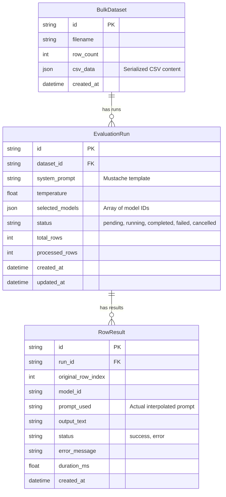

# Data Model: Bulk Evaluation

**Feature**: 007-bulk-evaluation
**Database**: SQLite

## Entity Relationship Diagram (Mermaid)

## Schema Definitions

### Table: `bulk_datasets`

| Column | Type | Constraints | Description |
|--------|------|-------------|-------------|
| id | TEXT | PRIMARY KEY | UUID |
| filename | TEXT | NOT NULL | Original filename |
| row_count | INTEGER | NOT NULL | Number of data rows |
| csv_data | TEXT | NOT NULL | JSON string of parsed CSV rows (array of objects) |
| created_at | INTEGER | NOT NULL | Timestamp (ms) |

### Table: `evaluation_runs`

| Column | Type | Constraints | Description |
|--------|------|-------------|-------------|
| id | TEXT | PRIMARY KEY | UUID |
| dataset_id | TEXT | NOT NULL | FK -> bulk_datasets.id |
| system_prompt | TEXT | NOT NULL | The template string |
| temperature | REAL | NOT NULL | 0.0 to 1.0 (or higher) |
| selected_models | TEXT | NOT NULL | JSON array of strings |
| status | TEXT | NOT NULL | pending/running/completed/failed/cancelled |
| total_rows | INTEGER | NOT NULL | Count of rows selected for this run |
| processed_rows | INTEGER | NOT NULL | Count completed so far |
| created_at | INTEGER | NOT NULL | Timestamp (ms) |
| updated_at | INTEGER | NOT NULL | Timestamp (ms) |

### Table: `row_results`

| Column | Type | Constraints | Description |
|--------|------|-------------|-------------|
| id | TEXT | PRIMARY KEY | UUID |
| run_id | TEXT | NOT NULL | FK -> evaluation_runs.id |
| original_row_index | INTEGER | NOT NULL | 0-based index from CSV |
| model_id | TEXT | NOT NULL | ID of the model used |
| prompt_used | TEXT | NOT NULL | The fully interpolated prompt |
| output_text | TEXT | NULL | The model response |
| status | TEXT | NOT NULL | success / error |
| error_message | TEXT | NULL | If status is error |
| duration_ms | REAL | NULL | Execution time |
| created_at | INTEGER | NOT NULL | Timestamp (ms) |

## Indexes

- `idx_runs_dataset_id` ON `evaluation_runs(dataset_id)`
- `idx_results_run_id` ON `row_results(run_id)`
